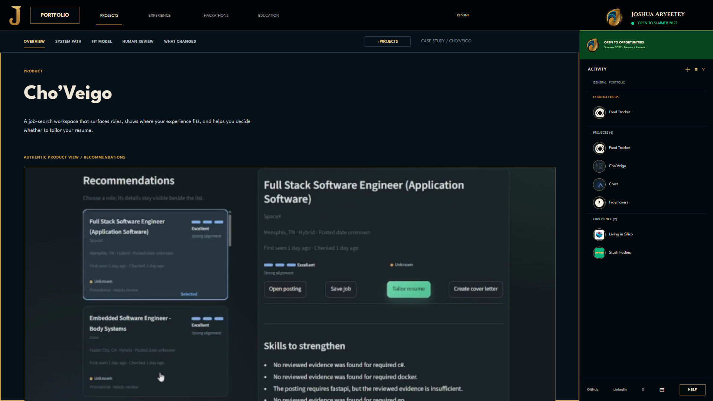
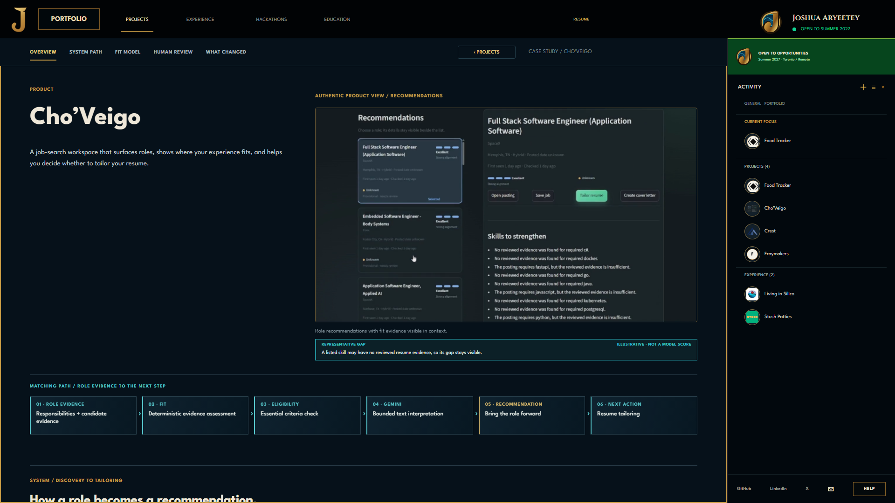

# Cho'Veigo React render sync — 2026-09-30

The full-page Figma balance review (`3286:603`) found the product-first sequence sound. A local 1920×1080 Chrome comparison then revealed a real implementation gap: the React Recommendations capture sat below the intro and expanded to nearly the full content width, unlike the two-column Figma opening at `1817:425`.

The desktop rule in `src/cho-evidence-worksheet.css` now keeps the authentic 16:9 capture uncropped at 820×461.25 beside the product introduction. At narrower widths the content stacks. The corrected render places the matching-path section directly after the demo at the intended scale, with the whole-system architecture following below.

| Before: stacked and over-wide | After: aligned with Figma |
|---|---|
|  |  |

**Status:** local desktop render aligned with the reviewed Figma relationship; story structure preserved; owner review remains open. Do not make another scale/layout pass without owner feedback or a new measured gap.
